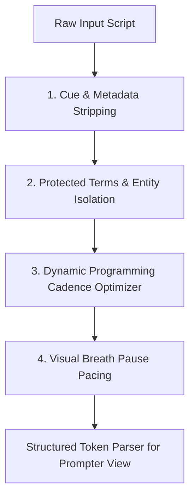

# Teleprompter Script Phrasing & Cadence Engine

## Executive Summary

The [`static/formatter.js`](../static/formatter.js) module is an independent, testable script formatting and phrasing engine. It transforms continuous prose or rough drafts into rhythmically structured, presenter-ready teleprompter text.

When reading from a teleprompter, speakers face several cognitive hurdles:
- **Eye fatigue & head bounce:** Sentences that run edge-to-edge across the screen force horizontal head movement.
- **Rushed delivery:** Blocks of continuous text lack visual indicators for when to pause, inhale, or emphasize points.
- **Awkward phrasing splits:** Arbitrary line breaks split technical product names or leave prepositions hanging at the end of lines, causing stumble-prone deliveries.

`TeleprompterFormatter` solves these challenges through a deterministic 4-stage pipeline:



---

## 1. Non-Spoken Cue & Stage Direction Stripping

Before text is broken into spoken cadence, non-vocal cues must be stripped so they are never counted towards word budgets or sent to the speech aligner:

```javascript
cleanCues(text)
```

| Cue Type | Example Syntax | Handled By |
| :--- | :--- | :--- |
| **Bracketed Directions** | `[CAMERA 1 - CLOSE UP]`, `[PAUSE]`, `[SLIDE 4]` | `replace(/\[[^\]]*\]/g, ' ')` |
| **Parenthetical Stage Directions** | `(smiling)`, `(pause)`, `(applause)`, `(clears throat)` | Selective regex checking common action verbs |
| **Speaker Identifiers** | `HOST:`, `SPEAKER 1:`, `INTERVIEWER:` | `replace(/^[A-Z0-9\s_-]{2,25}:\s*/gm, '')` |

> [!NOTE]
> Stage cues are replaced with single spaces rather than entirely collapsed, preserving token boundaries for adjacent words.

---

## 2. Protected Terms & Compound Entity Preservation

Breaking multi-word technical terminology across line breaks forces the speaker's eyes to jump while pronouncing complex concepts. The engine protects these ranges with two complementary mechanisms:

### A. Explicit Domain Term Dictionary (`DEFAULT_PROTECTED_TERMS`)
Configured in [`static/formatter.js:L49-L73`](../static/formatter.js#L49-L73), covering precision engineering and automotive vocabulary:
- `Turbo Technics VTR100 EVO`
- `variable geometry turbochargers`
- `proven flow measurement technology`
- `exhaust gas recirculation systems`

### B. Automatic Capitalized Cluster Detection
Any sequence of 2 to 6 capitalized words (e.g. `Federal Reserve Chairman`, `Antigravity Coding Assistant`) is automatically detected as a proper noun cluster and assigned an atomic protected range `[start, end)`.

```javascript
function splitsProtected(idx, ranges) {
  for (const r of ranges) {
    if (idx > r.start && idx < r.end) return true;
  }
  return false;
}
```
If a proposed line break index falls strictly inside any protected range, the optimizer skips that break entirely.

---

## 3. Dynamic Programming Cadence Optimizer

The core algorithm of the module is `chunkSentence(sentence, options)`. Rather than using a naive greedy word-counter, it applies **Dynamic Programming (DP)** to find the globally optimal set of line breaks for every sentence.

### The Problem Formulation
Given a sentence with $N$ words, find split indices $0 = i_0 < i_1 < \dots < i_k = N$ minimizing total aesthetic and delivery cost:

$$\text{Total Cost} = \sum_{m=1}^{k} \text{Cost}(i_{m-1}, i_m)$$

### Penalty & Reward Scoring Matrix

```
                      Cost Evaluation per Proposed Chunk
┌───────────────────────────────────────┬──────────────────────────────────────┐
│ Criteria                              │ Cost Adjustment                      │
├───────────────────────────────────────┼──────────────────────────────────────┤
│ 6 or 7 words (The "Sweet Spot")       │ +0   (Perfect cadence)               │
│ 5 or 8 words                          │ +2   (Acceptable boundaries)         │
│ 4 words                               │ +80  (Undersized)                    │
│ 3 words                               │ +200 (Too short)                     │
│ <= 2 words                            │ +500 (Fragments)                     │
│ > 8 words                             │ Hard loop exit (Forbidden)           │
│ Break inside protected phrase         │ Skipped entirely (Forbidden)         │
│ Dangling word at line end             │ +1000 penalty                        │
│ Punctuation break (comma, colon, etc.)│ -15 bonus                            │
│ Next line begins with conjunction     │ -8 bonus (Forward momentum)          │
│ Next line begins with preposition     │ -5 bonus (Forward momentum)          │
└───────────────────────────────────────┴──────────────────────────────────────┘
```

### Dangling Word Elimination (`DANGLING_WORDS`)
Lines that end in incomplete grammatical thoughts trip up speakers. The engine checks the ending word against a union of three grammatical sets:
1. **Prepositions:** `in`, `on`, `at`, `to`, `for`, `with`, `by`, `from`, `of`, `into`, `through`, etc.
2. **Conjunctions:** `and`, `or`, `but`, `nor`, `so`, `yet`, `because`, `although`, `since`, `while`, etc.
3. **Articles & Determiners:** `a`, `an`, `the`, `this`, `that`, `these`, `those`, `my`, `your`, `our`, etc.

Any line ending on these words incurs a massive `+1000` penalty, pushing the break to a more natural spoken boundary.

---

## 4. Visual Breath Pauses & Rhythm Pacing

Speaking naturally requires rhythmic pauses for breath. The engine inserts deliberate visual cues:

1. **Inter-Sentence Breath Pauses:** Between distinct sentences, a blank line (`""`) is inserted. This manifests as physical vertical spacing in the prompter view, signaling the presenter to take a clean breath before beginning the next thought.
2. **Clause Pacing for Long Sentences:** For compound sentences exceeding 20 words, if a major clause boundary (comma, semicolon) occurs with $\ge 14$ words spoken and $\ge 10$ words remaining, an intra-sentence breath pause is inserted.

---

## 5. Token Parsing for Presentation (`parseTokens`)

The final phase converts formatted text into structured data structures consumed by [`static/app.js`](../static/app.js) and the server's speech tracking:

```typescript
interface TokenResult {
  lines: Array<{
    lineIdx: number;
    words: Array<{ globalIdx: number; lineIdx: number; original: string }>;
    isBlank: boolean;
  }>;
  allWords: Array<{
    globalIdx: number;
    lineIdx: number;
    original: string;
  }>;
}
```

- **Contiguous Word Indexing:** `globalIdx` guarantees a 1:1 match with the Whisper `word_index` broadcast over WebSocket.
- **Preserved Punctuation:** `original` maintains commas and quotes for display while the aligner strips punctuation under the hood for speech matching.

---

## Summary of Benefits

| Aspect | Without Formatter | With `TeleprompterFormatter` |
| :--- | :--- | :--- |
| **Line Length** | Irregular (1 to 25 words) | Controlled (strictly 5–8 words) |
| **Delivery Pacing** | Fast, breathless | Measured, cadence-chunked with breath pauses |
| **Line Endings** | Hanging prepositions (*"we looked at / the results"*) | Complete phrases (*"we looked at the results"*) |
| **Technical Terms** | Split mid-phrase across lines | Protected as single-line units |
| **Testability** | Entangled in DOM code | 100% testable via Node.js (`test_formatter.js`) |
