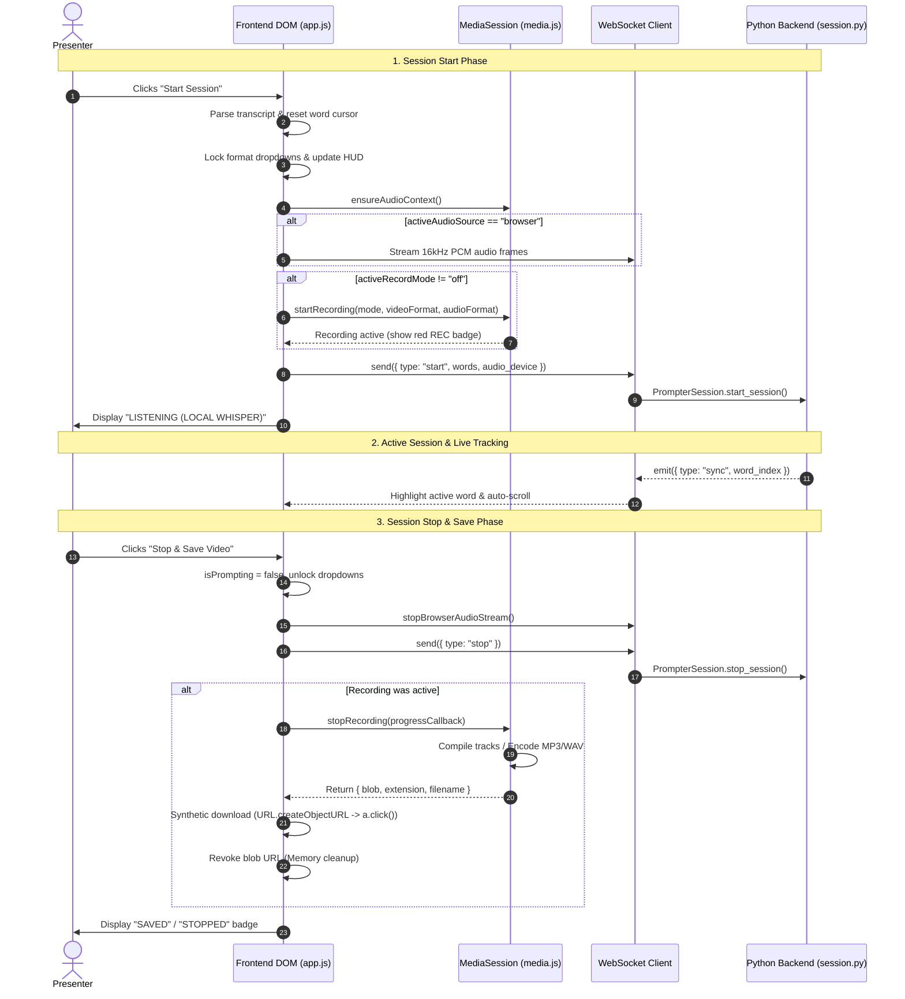

# Teleprompter Session & Recording Lifecycle

## Executive Summary

The code block spanning lines 1550–1645 in [`static/app.js`](../static/app.js) is the **Session & Recording Lifecycle Controller** of the teleprompter. 

Whenever the presenter clicks **Start Session** (or **Stop & Save**), this controller orchestrates three independent asynchronous pipelines simultaneously:
1. **Speech Alignment Pipeline:** Prepares script tokens, binds the target audio input device, and instructs the local Python backend via WebSocket to begin speech tracking.
2. **Audio Streaming Pipeline:** If browser-mode audio is active, routes live 16&nbsp;kHz mono PCM frames across the WebSocket connection to Whisper.
3. **Media Recording & Encoding Pipeline:** Acquires audio/video tracks via `TeleprompterMedia.MediaSession`, captures streams with `MediaRecorder`, performs software encoding (e.g. MP3/WAV), and delivers the finished file straight to the user's hard drive without touching the server.

---

## Architectural Flow



---

## Component Breakdown

### 1. The Start Routine (`btnStart`)

Located in [`static/app.js:L1551-L1600`](../static/app.js#L1551-L1600):

| Step | Operation | Conceptual Purpose |
| :--- | :--- | :--- |
| **Pre-flight Checks** | `if (isPrompting \|\| !transcriptInput.value.trim()) return;` | Prevents duplicate invocations or starting with an empty script. |
| **State Reset** | `currentWordIndex = 0; isPrompting = true;` | Resets the presentation reading pointer to the very first token. |
| **UI Locking** | `optRecordMode.disabled = true; optRecordFormat.disabled = true;` | Prevents the presenter from switching output formats mid-take, which would crash media recording pipelines. |
| **Audio Hydration** | `await mediaSession.ensureAudioContext();` | Overcomes modern browser autoplay restrictions by resuming the `AudioContext` inside a direct user gesture. |
| **Live Ingestion Route** | `if (activeAudioSource === 'browser') startBrowserAudioStream();` | Feeds microphone samples into the resampler pipeline if using WebRTC input instead of direct PyAudio hardware. |
| **Recording Initialization** | `await mediaSession.startRecording(...)` | Instantiates `MediaRecorder` or raw PCM accumulation depending on selected format. Wrapped in `try/catch` to enable graceful "sync-only" degradation if webcam access is blocked. |
| **Backend Handshake** | `send({ type: 'start', words, audio_device })` | Notifies `PrompterSession` on the Python server to spin up the speech-recognition loop. |

> [!NOTE]
> **Graceful Degradation:** If the user denies camera or microphone access for recording, `mediaSession.startRecording` throws an error. The `catch` block catches this and sets the status HUD to `"Recording unavailable – running sync-only"`. The teleprompter continues tracking speech smoothly rather than halting.

---

## 2. The Stop & Export Routine (`btnStop`)

Located in [`static/app.js:L1602-L1645`](../static/app.js#L1602-L1645):

```javascript
btnStop.addEventListener('click', () => {
  isPrompting = false;
  stopBrowserAudioStream();
  // ...
  send({ type: 'stop' });
  // ...
});
```

#### Key Mechanics:
1. **Immediate Teardown:** Instantly disables audio streaming tasks and notifies the server over WebSocket to halt the Whisper transcription thread.
2. **Asynchronous Finalization:** Halting video/audio capture requires asynchronous finalization (flushing internal buffers, computing duration metadata, or running LAME MP3 conversion). The controller passes a progress callback to `mediaSession.stopRecording(onProgress)` to update the HUD badge (`ENCODING…`).
3. **Zero-Server Client Download:**
   - Once encoding resolves, the controller receives `{ blob, extension, filename }`.
   - It synthesizes an anchor tag `<a style="display:none">` referencing `URL.createObjectURL(blob)`.
   - Triggers programmatic `.click()`, prompting the user's browser to save the file locally (e.g. `~/Downloads/Teleprompter-Session-2026-09-29.mp4`).
   - Cleans up memory via `setTimeout(() => { document.body.removeChild(a); window.URL.revokeObjectURL(url); }, 150)`.

---

## Rehearsal Mode vs. Live Recording Modes

The controller behaves differently depending on whether the session was triggered by the standard **Start Session** button or the **Rehearse** button:

| Feature / Behavior | Live Recording Mode (`btnStart`) | Trial Rehearsal Mode (`btnRehearse`) |
| :--- | :--- | :--- |
| **Audio/Video Recording** | Active (`mp4`, `webm`, `mp3`, `wav`) | **Strictly Disabled** (Zero disk/memory overhead) |
| **Local Whisper Tracking** | Active | Active |
| **Fumble Catcher** | Inactive | Active (categorizes skips, repeats, stumbles) |
| **Stop Behavior** | Saves & downloads media file to disk | Displays fumble tally & persists highlights |
| **HUD Completion State** | `"Session video saved (MP4)!"` | `"Trial complete! 3 fumbles highlighted..."` |

---

## Architectural Strengths

1. **Zero Server Load for Video Encoding:** All video and audio multiplexing occurs entirely within the client's WebAssembly / browser runtime. The Python server concentrates 100% of CPU/GPU resources on Whisper inference.
2. **Decoupled Architecture:** The UI controller does not need to know the mathematical details of PCM resampling or LAME bitrates; it simply passes parameters (`activeRecordMode`, `activeVideoFormat`) to the deep `mediaSession` module.
3. **Memory Safety:** Automatically revoking blob URLs (`URL.revokeObjectURL`) ensures long takes do not cause memory leaks during repeated rehearsals.
